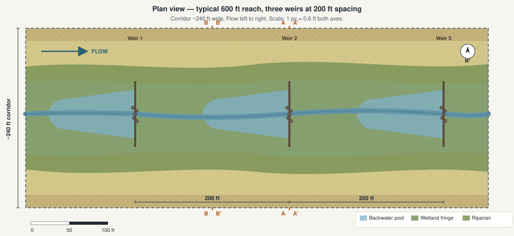

# Rock Creek Concept — Typical Reach Design (Concept-Stage Best Guess)

**Companion to:** the five technical deliverables (`01`–`05`).
**Status:** Concept-stage **best-guess** design illustration for stakeholder discussion. **Not engineering.** Numbers, materials, species, spacing, and dimensions are reasonable assumptions made for visualization, drawn from the source documents in this repo and standard low-tech process-based restoration practice. Every dimension is a working placeholder until verified by site survey, hydraulic design, and a qualified geomorphologist / botanist.

---

## 1. What This Document Shows

Three diagrams at one assumed weir spacing — **200 ft** — to make the concept tangible:

- **Plan view** of a typical 600 ft reach with three weirs and the lateral planting zones.
- **Cross section A–A** through one weir, showing the weir structure, channel, floodplain bench, and water-surface lines at low flow and at the design event.
- **Cross section B–B** halfway between two weirs, in the sustained backwater pool, showing the wetter conditions that develop where the pool persists through the wet season.

A planting palette and habitat-design notes follow the diagrams.

**These dimensions are not the only valid choice.** They illustrate one internally-consistent set of assumptions; the actual design will be set by hydraulic modeling, topographic survey, and reach-by-reach subsurface confirmation per Deliverable 4 (Roadmap).

---

## 2. Design Assumptions Used in the Diagrams

| Parameter | Value | Basis |
| --- | --- | --- |
| Weir spacing along the corridor | **200 ft** (constant, for illustration) | User-specified for this exercise |
| Weir height | **2.5 ft** typical | Concept draft (2–3 ft range), middle value |
| Weir crest elevation, relative to channel bed | +2.5 ft | = bench-top elevation, so overflow spills laterally onto the bench |
| Channel width (low-flow inset) | ~30 ft | Reasonable for a corridor swale at this scale |
| Channel depth (bed to bank) | 2.5 ft | Allows weir crest to equal bench-top |
| Active corridor width | ~240 ft (within ~250 ft easement) | Mid-range of plausible widths; concept-stage `[VERIFY]` |
| Reach longitudinal slope | ~0.5% | Typical for valley-floor distributary corridors |
| Backwater length above each weir, at design flow | ~250 ft | At a 1% energy slope, a 2.5 ft head builds back roughly this far before normalizing — so at 200 ft spacing, **the pools overlap into a near-continuous slack-water surface during the design event** |
| Vertical scale exaggeration in section views | ~8× | Standard for low-relief floodplain sections |

---

## 3. Plan View — One 600 ft Reach with Three Weirs

<figure>

<figcaption><strong>Plan view, 200 ft weir spacing.</strong> Flow is left to right. Three rock weirs sit 200 ft apart across the channel and key into the floodplain benches. Upstream of each weir, a backwater pool extends through the wet season; at 200 ft spacing, these pools overlap into a near-continuous slack-water corridor during the design event. Planting zones run as concentric bands from the channel outward: <strong>wetland fringe</strong> (closest to the wetted channel), <strong>riparian woody</strong>, <strong>native grassland</strong>, and <strong>terrace / upland</strong> at the easement edge. Section cut-lines A–A (at a weir) and B–B (mid-pool between weirs) reference the next two diagrams.</figcaption>
</figure>

---

## 4. Cross Section A–A — At a Weir

<figure>

<figcaption><strong>Section A–A, at a weir, looking downstream.</strong> The weir spans the channel and keys 5 ft into each bench. Weir crest elevation equals the bench top, so flow above crest both passes downstream and spills laterally onto the bench. At low flow the weir holds an impoundment to crest level (2.5 ft). At the design event (sized for a frequent-to-moderate flood — Q5 or Q10), the water surface stands roughly 1 ft above crest and spreads across the full active corridor. The shaded layer at depth flags the <em>shallow restrictive layer</em> finding from the RCRD Infiltration Study — where present, infiltration is slow; weir locations should be screened reach-by-reach (see Deliverable 4 Roadmap, Section 2).</figcaption>
</figure>

### Weir construction details (best-guess; refine in design)

- **Material.** Locally-sourced angular rock; **D50 ≈ 18 in**, range 8–24 in. Larger keystone rock (≥24 in) at the crest line. Choose rock weight on the basis of the design stream-power calculation; the values here are typical for low-tech process-based restoration in similar settings.
- **Cross-section shape.** Trapezoidal with a **2:1 upstream face** and a **5:1 downstream apron**. The flat downstream apron dissipates energy and prevents scour; per Nord's geomorphic findings (SSI > 1 at multiple Rock Creek sites, knickpoints downstream of headcuts), scour is a real risk if the apron is undersized.
- **Bank keys.** Each abutment extends ~5 ft laterally into the bench and ~3 ft below bench grade. Without proper keys, weirs are flanked at moderate flow.
- **Foundation.** Excavate to firm bed; geotextile underlayment if the bed is fine-grained; subsurface rock key extends ~3 ft below the channel bed (shown in shaded box at the weir base).
- **Per-weir footprint.** ~40 ft along flow × ~30 ft across (channel) + bank keys = approximately **1,200 sf disturbance**, of which ~600 sf is in-channel.
- **Per-weir rock volume.** Order-of-magnitude **60–80 cy** total (crest + apron + bank keys). At Nord's 2023 unit-cost basis of $40/cy for in-creek rock, that is **~$2,500–3,200 in materials per weir**; with mobilization, labor, and CDFW 1602 compliance, total installed cost more likely **~$10,000–15,000 per weir** `[VERIFY: cost basis from RDS pilot projects, not yet in this repo]`.

### What this does hydraulically (concept-stage narrative — not modeled)

- **At low/normal flow:** Each weir holds a small pond to crest level; flow passes over crest as a thin sheet. The pools recharge the saturated-soil zone immediately adjacent to the channel, supporting the wetland-fringe planting band.
- **At a frequent flood (Q2–Q10):** Flow rises above crest, spills laterally onto the bench, slows due to vegetation roughness, and travels overland at greatly reduced velocity. This is the **flood-intensity-traded-for-duration** mechanism the concept draft describes.
- **At a 100-yr event:** Water is well above crest; the weirs are "drowned out." The BDA / RDS literature (Deliverable 3, Tier D) consistently shows attenuation **diminishes** at this magnitude. Honest framing: the headline flood-safety benefit is strongest at frequent events.

---

## 5. Cross Section B–B — Mid-Pool Between Two Weirs

<figure>

<figcaption><strong>Section B–B, 100 ft upstream of the next-downstream weir.</strong> No weir wall in this section &mdash; the channel is open. But the downstream weir holds a backwater pool that <strong>persists through the wet season</strong> and inundates the channel to roughly weir-crest elevation. Because saturation here is more frequent and longer-duration than at the weir, the <strong>wet-meadow planting band is wider</strong> than in Section A–A. At the design event, the water surface is slightly higher than at the weir (per the backwater profile) and spreads across the bench as in A–A.</figcaption>
</figure>

The single most important visual difference between the two sections: in A–A the weir physically constrains the channel; in B–B the channel is open but **water is everywhere** during the wet season because the next-downstream weir is impounding it. That is the design intent — a near-continuous slack-water corridor during the wet half of the year, with periodic flood inundation extending lateral wetting.

---

## 6. Planting Palette — by Hydrologic Zone

Selections are California natives appropriate to the Sacramento Valley / Vina Plains / Tuscan-aquifer setting, drawing on the Singer Creek HDP species suite (same area, well-documented in this repo's `SINGER` source) and standard low-tech PBR practice. All quantities are **concept-stage** and should be confirmed by a local restoration ecologist.

### Channel + sustained pool (permanent / near-permanent inundation)

| Species (scientific) | Common name | Form | Role |
| --- | --- | --- | --- |
| *Schoenoplectus acutus* | Hardstem bulrush | Tall emergent | Nesting habitat for **tricolored blackbird** (ST); sediment trap |
| *Eleocharis macrostachya* | Creeping spikerush | Low emergent | Bed cover, sediment retention |
| *Carex obnupta* | Slough sedge | Sedge | Bank stabilization at waterline |
| *Typha latifolia* | Broadleaf cattail | Tall emergent | Use sparingly &mdash; can dominate; tricolored blackbird habitat |

**Planting density.** Plugs at 18–24 in on center along the wetted channel edge; allow natural recruitment in the pool interior.

### Wet meadow / wetland fringe (seasonally saturated; wider band in mid-pool sections)

| Species | Common name | Form | Role |
| --- | --- | --- | --- |
| *Juncus balticus* | Baltic rush | Rush | Robust workhorse for the saturated band |
| *Juncus effusus* | Common rush | Rush | Same |
| *Carex barbarae* | Santa Barbara sedge | Sedge | California-native sedge, traditional cultural plant |
| *Eleocharis macrostachya* | Creeping spikerush | Low | Carpet cover, sediment trap |
| *Mimulus guttatus* | Yellow monkeyflower | Forb | Pollinator value; seasonal color |
| *Grindelia camporum* | Great Valley gumplant | Forb | Late-season pollinator forage |

**Planting density.** Plugs at 24–36 in on center; native-grass seed mix oversown.

### Riparian woody (occasional inundation; Q2–Q10 floodplain bench)

| Species | Common name | Form | Role |
| --- | --- | --- | --- |
| *Salix lasiolepis* | Arroyo willow | Tree/shrub | **Pole cuttings** &mdash; fastest establishment; bank stability |
| *Salix exigua* | Sandbar willow | Shrub | Pole cuttings; dense thickets for songbirds |
| *Salix gooddingii* | Goodding's willow | Tree | Larger canopy willow; pole cuttings |
| *Populus fremontii* | Fremont cottonwood | Tree | Pole cuttings; iconic Sacramento Valley canopy |
| *Alnus rhombifolia* | White alder | Tree | Nitrogen fixer; container stock |
| *Sambucus nigra ssp. caerulea* | Blue elderberry | Shrub/small tree | **VELB host species** &mdash; plant with proper buffer from any disturbance corridor |
| *Cornus sericea* | Red-osier dogwood | Shrub | Streambank stabilizer; fall color |
| *Baccharis salicifolia* | Mule fat | Shrub | Disturbance-tolerant pioneer |

**Planting density.** Trees 15–25 ft on center; shrubs 8–12 ft on center; cottonwood/willow poles 6 ft on center in dense restoration patches.

### Native grassland (rarely inundated upper bench / lower terrace)

| Species | Common name | Form | Role |
| --- | --- | --- | --- |
| *Stipa pulchra* | Purple needlegrass | Bunchgrass | California state grass; Swainson's hawk foraging habitat |
| *Bromus carinatus* | California brome | Bunchgrass | Cool-season anchor species |
| *Elymus glaucus* | Blue wildrye | Bunchgrass | Robust shaded-edge grass |
| *Festuca microstachys* | Small fescue | Bunchgrass | Annual native cover |
| *Lasthenia californica* | California goldfields | Forb | Vernal-pool-adjacent; spring color |
| *Lupinus bicolor* | Miniature lupine | Forb | Nitrogen fixer; pollinator |
| *Eschscholzia californica* | California poppy | Forb | Color; pollinator |

**Seeding rate.** ~25–35 lb/ac of a custom Sacramento Valley grassland mix; broadcast or drilled fall-of-construction.

### Terrace / upland edge (corridor margin and setbacks)

| Species | Common name | Form | Role |
| --- | --- | --- | --- |
| *Quercus lobata* | Valley oak | Tree | Keystone canopy tree; supports oak-woodland fauna |
| *Quercus douglasii* | Blue oak | Tree | Drier-edge oak |
| *Aesculus californica* | California buckeye | Small tree | Spring bloom; pollinator |
| *Cercis occidentalis* | Western redbud | Small tree | Spring color |
| *Heteromeles arbutifolia* | Toyon | Large shrub | Year-round structure; bird forage |
| *Rhamnus californica* | California coffeeberry | Shrub | Bird forage; structural anchor |

**Planting density.** Oaks 30–50 ft on center (with deer-protection cages); other tree/shrub species clustered in mosaic patches that leave open grassland gaps for Swainson's hawk foraging.

---

## 7. Habitat / Wildlife Design Considerations

Drawing on the sensitive-species exposure documented in `NORD_B3` Tables 2–3 (Deliverable 1, parameter table rows 41–42) and on Singer Creek's habitat-design principles:

| Species or group | Design implication |
| --- | --- |
| **Butte County meadowfoam** (FE/SE) | Avoid siting weirs or construction footprint near any existing meadowfoam pools or NRCS-protected meadowfoam habitat. Site-walk in spring before locating weirs; flag and protect existing meadowfoam patches. |
| **Vernal pool fairy shrimp / tadpole shrimp** (FT/FE) | Same. The wet-meadow band can host facultative vernal-pool flora but the corridor should **not be sited through known vernal pool complexes**. |
| **Valley elderberry longhorn beetle** (FT) | Elderberry plantings (*Sambucus nigra ssp. caerulea*) included in the riparian palette &mdash; cluster them in 100 ft buffers from any planned maintenance access. Per USFWS guidance, elderberry stems ≥1 inch diameter become VELB habitat. |
| **Swainson's hawk** (ST) | Maintain open grassland mosaic on the outer floodplain / terrace for foraging. Limit tree planting density on the upland zones; cluster trees rather than continuous canopy. |
| **Tricolored blackbird** (ST) | Tall emergent vegetation (bulrush, cattail) in the sustained pool sections provides nesting habitat. Design backwater pools to retain water through breeding season (April–July) where compatible with sediment-management cycles. |
| **Foothill yellow-legged frog** (SE), Pacific tree frog | Rocky downstream aprons provide riffles; pool edges with vegetation provide cover. Avoid creating deep year-round ponding that would favor introduced bullfrogs. **Design weirs to dewater seasonally** so the pool becomes shallow / dry by late summer; this disadvantages bullfrogs and favors natives. |
| **Chinook salmon spring-run / steelhead** (FT/ST) | These use Rock Creek; the diversion intake should pass fish per NMFS criteria, and any in-channel rock weir on Rock Creek itself (not in the corridors) must be **sized for fish passage**. Within the corridor (which is overland-spread, not anadromous-fish habitat), passage is not the binding constraint. |
| **Pollinators / native bees** | The native-grass + forb mix in the grassland zone is the primary pollinator habitat; orient seed mix to bloom March through October. |
| **Migratory birds** | All construction outside the Feb 1 – Aug 31 nesting window (per Singer Creek HDP, `SINGER` Sec. 1.3), or with pre-construction surveys and avoidance measures. |

---

## 8. Construction Approach (One Reach)

Best-guess sequence for installing the weir + plantings shown in Sections A–A and B–B:

1. **Pre-construction.** Topographic survey, geotechnical confirmation at the weir location (test pit or hand-auger to identify the restrictive layer depth flagged in the section drawings), and a botanical survey to confirm no meadowfoam / vernal-pool species in the disturbance footprint.
2. **Permitting in hand.** CDFW Sec. 1602 SAA, CWA 404 (NWP 27 if restoration intent qualifies), CWA 401, ESA Sec. 7 BO if federal nexus / Sec. 10 ITP otherwise, CEQA cleared.
3. **Construction window.** Dry season only (typically July–September in Butte County), outside the migratory bird nesting window where possible, or with monitoring.
4. **Site staging.** Single access point per reach; protect retained vegetation; salvage and store any clumps of native plants from the immediate footprint for replanting.
5. **Weir build.**
   - Excavate channel-bed key trench and both bank-key trenches.
   - Place geotextile underlayment if the bed is fine-grained.
   - Place foundation rock (largest, ≥24 in), then crest rock, then downstream apron rock.
   - Backfill bank keys; restore disturbed surface to grade.
6. **Plant the four hydrologic zones** in the same construction season, while ground is still disturbed and rooting conditions favor establishment.
7. **First-year monitoring.** Photo points, structure inspection after the first 2–3 flow events, replacement of any displaced rock. Plant survivorship census in early spring of year 2.
8. **Adaptive maintenance.** Per Singer Creek's grazing-and-monitoring model (Deliverable 3 §2.3): managed grazing for invasives, hand removal of priority weeds, structure inspection biennially.

---

## 9. What Is NOT Shown / `[VERIFY]` Items

These dimensions and decisions are **placeholders for a future engineered design** and must be resolved before any construction:

| Item | Status |
| --- | --- |
| Actual reach longitudinal slope | `[VERIFY: from topographic survey of each corridor]` |
| Actual corridor widths and topographic relief along the two corridors | `[VERIFY: not in the source documents]` |
| Hydraulic justification for 200 ft spacing at the design discharge | `[VERIFY: requires HEC-RAS 2D modeling per Deliverable 4, Step H-3 / H-4]` |
| Reach-specific weir height (not all reaches will use 2.5 ft) | `[VERIFY: function of local slope and bench elevation]` |
| Per-weir rock volume and exact gradation | `[VERIFY: stream-power calculation needed]` |
| Subsurface restrictive-layer depth at each candidate weir | `[VERIFY: corridor-specific FDEM survey per Deliverable 4, Step R-2]` |
| Bullfrog / non-native species control regime | `[VERIFY: management plan to be developed]` |
| Engineered fish-passage criteria on Rock Creek itself (intake/return points) | `[VERIFY: NMFS / CDFW criteria not yet applied]` |
| Final planting palette confirmed by Vina-Plains restoration ecologist | `[VERIFY: this list is best-guess based on Singer Creek HDP and standard practice]` |

---

## 10. Cross-References

- **Deliverable 1** — Parameter table rows 14–17 (weir parameters) and 41–47 (habitat / regulatory).
- **Deliverable 3** — Tier D (BDA literature) for the diminishing-attenuation finding at extreme events.
- **Deliverable 4** — Roadmap Steps H-2 (corridor DEM), R-1/R-2/R-3 (subsurface screening), S-3 (pilot reach), L-3 (landowner conversations) all feed directly into refining this reach design.
- **Deliverable 5** — Screening Spreadsheet `Inputs_Design` Section 5.3 (weir parameters).
- **`SINGER`** — Singer Creek HDP Vol. 1, Sections 5.1–5.6 for the species/restoration-design precedent.
- **`RCRD_INF`** — RCRD Infiltration Feasibility Study (Sand Creek), GeoSystems Analysis Appendix, for the shallow-restrictive-layer findings shown at the bottom of both section views.
