**Prepared for discussion with the Butte County Department of Public Works and the Butte County Department of Water and Resource Conservation.**

> **STATUS OF THIS REPORT — PLEASE READ FIRST.** This is a **concept-stage evaluation**, prepared by AGUBC as a synthesis of published studies of the Rock Creek / Keefer Slough / Sand Creek system. It is **not an engineering design, a legal opinion, or water-rights advice**, and no professional engineering stamp is expressed or implied. Quantities are order-of-magnitude (OOM) screening values intended to test whether the concept merits the next stage of analysis. Where a value could not be derived from a cited source, it is flagged **[VERIFY]** rather than estimated silently. The two highest-consequence unverified items — the corridor landowner picture and the corridor-specific subsurface conditions — are identified as the first work items in Section 9.

```{=openxml}
<w:p><w:r><w:br w:type="page"/></w:r></w:p>
```

# Preface

**The Vina Subbasin.** The Vina Subbasin (DWR Basin No. 5-021.57) covers approximately 289 square miles — roughly 185,000 acres — on the western side of Butte County in the Northern Sacramento Valley, including the City of Chico, the communities of Nord and Durham, and the surrounding agricultural lands. Approximately 110,000 people reside in the subbasin. It is predominantly groundwater dependent: about 91 percent of its water supply comes from groundwater, and agricultural irrigation accounts for about 93 percent of total water use (Geosyntec, 2026, Preface).

**Groundwater conditions and the GSP.** The Vina GSA and the Rock Creek Reclamation District GSA jointly prepared a single Groundwater Sustainability Plan, submitted in January 2022 and approved by DWR in July 2023. The GSP estimates the subbasin's sustainable yield at 233,500 acre-feet per year (AFY) against historical pumping of approximately 243,500 AFY, with a long-term annual storage decrease of approximately 10,000 AFY that may be as high as 20,000 AFY (Geosyntec, 2026, Preface, citing the GSP). Recent wet years have stabilized groundwater levels — the Water Year 2025 Vina Subbasin Annual Report found no minimum-threshold exceedances and storage growing at roughly 8,000 acre-feet per year — but the subbasin must still close its long-term gap to achieve sustainability by 2042, and prepare for the next drought.

**The County's adopted answer includes exactly this kind of project.** The Butte County Recharge Action Plan, adopted by the Board of Supervisors in February 2024, establishes a goal of expanding average annual groundwater recharge by approximately **20,000 acre-feet**, prioritizes the Vina Subbasin, and organizes its strategy around five categories of action. The first category is **"spreading and slowing flood flows to allow more water to infiltrate into the ground,"** with emphasis on capturing high-flow storm events and on enhancing natural processes rather than building large new infrastructure (BCWRC, 2024; as summarized in Geosyntec, 2026, Sec. 2.6). Separately, the County's Component 5 recharge investigation (Geosyntec, 2026) has completed pilot testing across the subbasin — finding some of the most favorable infiltration conditions **near the confluence of Keefer Slough and Rock Creek** — and has advanced preliminary designs for a series of FloodMAR infiltration basins along the Rock Creek–Keefer Slough corridor.

**Purpose of this report.** This report describes a complementary concept in the same watershed: diverting a portion of Rock Creek's flood flows approximately 1.1 miles upstream of the Rock Creek / Keefer Slough bifurcation and spreading them across roughly 10.4 miles of overland corridors treated with hundreds of low rock weirs — reducing the flood peaks that reach Keefer Slough and State Route 99 while recharging the Tuscan aquifer system and reactivating floodplain habitat. The concept applies the Recharge Action Plan's first action category at corridor scale. This report synthesizes the published studies that bear on the concept, states what they establish and what remains open, presents an order-of-magnitude cost-benefit screen, and lays out a phased roadmap in which the highest-risk questions are answered first and cheaply.

```{=openxml}
<w:p><w:r><w:br w:type="page"/></w:r></w:p>
<w:p><w:pPr><w:jc w:val="center"/></w:pPr><w:r><w:rPr><w:b/><w:sz w:val="28"/></w:rPr><w:t>TABLE OF CONTENTS</w:t></w:r></w:p>
<w:sdt><w:sdtPr><w:docPartObj><w:docPartGallery w:val="Table of Contents"/><w:docPartUnique/></w:docPartObj></w:sdtPr><w:sdtContent><w:p><w:r><w:fldChar w:fldCharType="begin" w:dirty="true"/></w:r><w:r><w:instrText xml:space="preserve"> TOC \o "1-2" \h \z \u </w:instrText></w:r><w:r><w:fldChar w:fldCharType="separate"/></w:r><w:r><w:t>Right-click here and choose "Update Field" to generate the table of contents.</w:t></w:r><w:r><w:fldChar w:fldCharType="end"/></w:r></w:p></w:sdtContent></w:sdt>
<w:p><w:r><w:br w:type="page"/></w:r></w:p>
```

# 1. Introduction

## 1.1 Purpose and Objectives

The purpose of this report is to give Butte County's Public Works and Water and Resource Conservation leadership a complete, source-cited picture of the Rock Creek floodwater spreading concept at its current stage of development, in a form suitable for evaluation and discussion. The concept has four objectives:

1. **Reduce flood risk on Keefer Slough and at State Route 99** by removing a portion of Rock Creek's flood peak upstream of the bifurcation that feeds Keefer Slough;
2. **Recharge the Tuscan aquifer system** in support of Vina Subbasin sustainability and the Butte County Recharge Action Plan;
3. **Reactivate floodplain habitat** across two overland corridors currently bypassed by fast-moving flood flow; and
4. **Trade flood intensity for flood duration** — returning a longer, lower, slower flood wave to Rock Creek downstream.


## 1.2 Scope and Status

This report is a **synthesis and screening evaluation**, not a design. It recomposes eight concept-stage technical deliverables prepared for AGUBC in May 2026, which in turn mined four published source studies of this watershed (Section 2) plus the County's June 2026 Component 5 recharge report. Three conventions govern every number in this report:

- **Source-cited or flagged.** Every quantitative value is either cited to a published source or carried as a **[VERIFY]** placeholder. No value has been filled in by assumption without being labeled as such.
- **Order-of-magnitude discipline.** Cost and yield figures are OOM screening values presented as low / central / high ranges. They exist to test whether the concept is worth the next analysis stage — not to support appropriation-level budgeting.
- **Transferability discipline.** The most geometrically similar precedent (the Nord Feasibility Study) is a **dam-based** design. Its hydrology, watershed data, and unit costs transfer to this concept; its dam-storage attenuation results, dam mitigation costs, and reservoir impacts do **not**, and are never used here.

## 1.3 Report Organization

Section 2 reviews previous studies. Section 3 states the flooding problem quantitatively. Section 4 describes the concept. Section 5 places it among comparable projects. Section 6 assesses feasibility across six domains. Section 7 presents the water balance and recharge estimate. Section 8 presents order-of-magnitude cost and benefit. Section 9 lays out the implementation roadmap. Section 10 surveys funding. Appendices are incorporated by reference to the project's online technical annex (Appendix A).

# 2. Previous Studies

Five bodies of prior work bear directly on this concept. Each is summarized for what it contributes and — equally important — for what does not transfer.

## 2.1 Nord Feasibility Study (Wood Rodgers, 2023)

Prepared for the Town of Nord flood-risk problem, this study examined diversion alternatives from Rock Creek into the Sand Creek watershed — the closest published match for this concept's diversion-and-routing geometry. Its Sand Creek Diversion Alternative placed an intake approximately 1.4 miles upstream of the Rock Creek / Keefer Slough bifurcation; its Tributary Diversion Alternative placed one approximately 0.6 miles upstream. The concept's proposed intake location (~1.1 miles upstream) is bracketed by these two precedents. The study contributes the watershed's governing hydrology (Section 3), geomorphic and sediment characterization, environmental constraints inventory, and 2023-basis unit costs for diversion and conveyance works.

**What does not transfer:** both Nord alternatives rely on large earth dams (46.4 feet and 35.5 feet high, impounding 7,990 and 2,870 acre-feet respectively), at total alternative costs of $370.68 million and $222.10 million, dominated by dam fill, outlet works, land acquisition, and approximately $164 million of environmental mitigation driven by reservoir inundation. None of those elements exists in a distributed rock-weir concept, and none of Nord's attenuation or mitigation-cost results is used in this report.

## 2.2 Rock Creek Reclamation District Infiltration Feasibility Study (Wood Rodgers / GeoSystems Analysis, 2023)

The "Sand Creek Infiltration Study" is the **primary same-area source** for the recharge question, covering the same Sand Creek system the concept's north corridor traverses. Its key transferable findings: a GSA-determined **long-term constant infiltration rate of 0.7 feet per day** at the five most favorable Sand Creek sites; NRCS-derived estimates of less than 0.2 feet per day across most of the study area, with favorable channel corridors up to 0.6 feet per day; an experience-based **channel-infiltration bonus of up to ~50 percent** above basin-area infiltration; hardpan or restrictive layers **as shallow as 2 feet below ground surface** at some locations, with strong spatial variability (downstream Sand Creek's Redsluff gravelly loam lacks a restrictive layer in the top 80 inches, while upstream and northern areas rate poor to very poor); depth to groundwater of 60–110 feet with permeable material extending to 300–350 feet; and a finding that most candidate sites lie within **NRCS conservation easements** requiring extensive coordination. The study also establishes that individual structures below the 6-foot Division of Safety of Dams height threshold are non-jurisdictional, and that the Sand Creek system lies outside Central Valley Flood Protection Board jurisdiction.

## 2.3 Singer Creek Preserve Habitat Development Plan (Restoration Resources for BCAG, 2008–2009)

Located north of the concept area, Singer Creek is **not a flood precedent** — its plan does not analyze flood attenuation — but it is the region's working model for three things this concept needs: a **perpetual land-control and stewardship structure** (fee title plus conservation easement plus endowment, held with an accredited land trust); a **restoration permitting pathway** (Clean Water Act Nationwide Permit 27 for aquatic habitat restoration, far lighter than an individual permit); and **habitat design in Tuscan soils**, which carry a duripan at 18–22 inches — a constraint Singer Creek turned into a design asset for seasonal-wetland creation.

## 2.4 Caltrans District 3 Hydraulic Branch Memorandum (Lee, 2025)

The November 2025 Caltrans memorandum, *Studying the Flooding Issues Along Hwy 99 from Mud Creek to Rock Creek*, supplies the current-conditions hydraulic picture from the DWR / Wood Rodgers HEC-RAS 2D model: the Keefer Slough 100-year discharge near Garner Lane is **3.52 times** the effective FEMA value, and the Rock Creek / Keefer Slough bifurcation split has shifted from 56/44 to **39/61** because of sediment deposition and vegetation growth (Section 3). The memorandum recommends regular maintenance at the bifurcation under a multi-party agreement — a parallel and reinforcing measure discussed in Section 6.1.

## 2.5 Geosyntec Component 5 Recharge Investigation (Geosyntec, 2026)

The County's June 2026 *Combined Groundwater Recharge Investigation and Preliminary Design Report / Pilot Project Implementation Report* (Vina GSA SGM Grant Component 5, prepared for BCWRC) is the most recent and most consequential related work. Four of its results bear directly on this concept:

1. **Same-area infiltration evidence.** From more than 15 candidate sites screened and 7 investigated, the most favorable infiltration results in the subbasin were observed at a site along Comanche Creek **and one near the confluence of Keefer Slough and Rock Creek**, where permeable materials supported effective infiltration (Geosyntec, 2026, Preface). This is independent, recent, field-tested evidence of recharge capacity in the concept's immediate area, complementing the Sand Creek study's findings.
2. **A corridor FloodMAR program is already in preliminary design.** The report advances preliminary designs for a series of FloodMAR infiltration basins along the Rock Creek–Keefer Slough corridor (Sites N4, N5, and N6), "designed to capture and distribute high-flow surface water across multiple locations to enhance groundwater recharge while reducing peak flows within the watershed" (Geosyntec, 2026, Sec. 7). The rock-weir concept described here is a distinct and complementary intervention — an upstream diversion with distributed overland treatment, rather than discrete basins — applying the same slow-spread-recharge logic in the same system. The two approaches are mutually reinforcing, not competing; Section 6 discusses coordination.
3. **A demonstrated water-rights pathway.** Component 5 pilots diverted flood water under **Water Code Section 1242.1** — the temporary FloodMAR authority enacted by SB 122 (2023) — and the report analyzes that pathway's yield and its extensions in detail. Section 6.4 of this report builds directly on that analysis.
4. **AGUBC's role.** AGUBC provided stakeholder engagement, landowner outreach, and facilitation of site identification for Component 5 (Geosyntec, 2026, Acknowledgements). The present concept emerged from the same landowner-facing work, and this report is offered in the same collaborative spirit.

## 2.6 Vina Subbasin GSP and the Recharge Action Plan

The Vina GSP identifies groundwater recharge as a central sustainability strategy and explicitly promotes a **distributed** approach — enhancing recharge in natural and modified channels to "slow and spread" flows during high-water events — over reliance on any single large facility (Geosyntec, 2026, Sec. 2.5). The Butte County Recharge Action Plan (February 2024, Board-adopted) sets the ~20,000 AFY recharge-expansion goal and lists the spreading and slowing of flood flows as its first category of action (Geosyntec, 2026, Sec. 2.6). This concept is a direct, corridor-scale implementation of that adopted direction.

# 3. The Flooding Problem

## 3.1 Setting

Rock Creek drains a 67-square-mile watershed; 61 square miles lie above its bifurcation with Keefer Slough, and approximately 25 square miles lie above the concept's proposed intake point ~1.1 miles upstream of the bifurcation (Wood Rodgers, 2023, Tables 10–11; Part B geomorphic assessment). During large events, a substantial share of Rock Creek's discharge diverts into Keefer Slough at the bifurcation, and Keefer Slough's flooding — including at State Route 99, where the channel capacity is only 525 cfs — is driven primarily by that transfer rather than by Keefer's own 4.4-square-mile local watershed. No streamflow gauge exists on Rock Creek or its tributaries; all published discharge estimates are modeled.

## 3.2 Four Datasets, Material Disagreement

Four published peak-flow datasets exist for this system, and they disagree materially — most at the frequent events where a distributed-weir concept shows its strongest benefit.

| Annual exceedance | 2011 FIS Effective (cfs) | USGS StreamStats (cfs) | Nord HEC-HMS "Current Study" (cfs) |
|---|---|---|---|
| 10% (Q10) | 2,300 | 3,580 | 5,185 |
| 2% (Q50) | 4,400 | 6,000 | 7,115 |
| **1% (Q100)** | **5,600** | **7,170** | **8,020** |
| 0.2% (Q500) | 7,800 | 10,000 | 10,220 |

*Rock Creek ~0.91 mi upstream of the bifurcation (~25 sq mi) — the published analysis point closest to the concept intake. Source: Wood Rodgers (2023), Tables 10–12. StreamStats' "1%-plus" value of 17,100 cfs is a regression-tail artifact and is excluded from design use.*

The Q100 spread is 5,600–8,020 cfs — roughly 43 percent. The 2011 FIS values are lowest because FEMA adopted gauge-based peaks from adjacent Little Chico Creek as a proxy; the Nord study built a rainfall-runoff model on Rock Creek itself and reports the FIS values as on the order of 35 percent lower than its results (Wood Rodgers, 2023, Sec. VII.D).

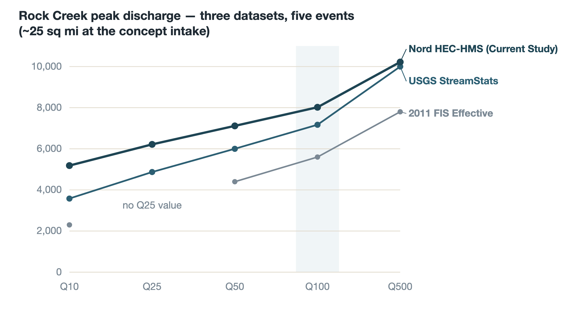

## 3.3 The Garner Lane Discrepancy: 3.52×

The fourth dataset — the DWR / Wood Rodgers HEC-RAS 2D hydraulic model, the model FEMA is reviewing for the anticipated 2027 FIRM update — reports a Keefer Slough 100-year discharge of **2,390.90 cfs** approximately 1,099 feet upstream of Garner Lane, against the effective FEMA FIS value of **680 cfs** at essentially the same location: **3.52 times larger** (Lee, 2025, Sec. 1). Measured against the current regulatory numbers, Keefer Slough flooding looks like a modest problem. Measured against the model FEMA will adopt, it is the dominant flood-risk corridor in this system — and residents and infrastructure along it, including SR 99, will feel that change directly when the FIRM update lands.

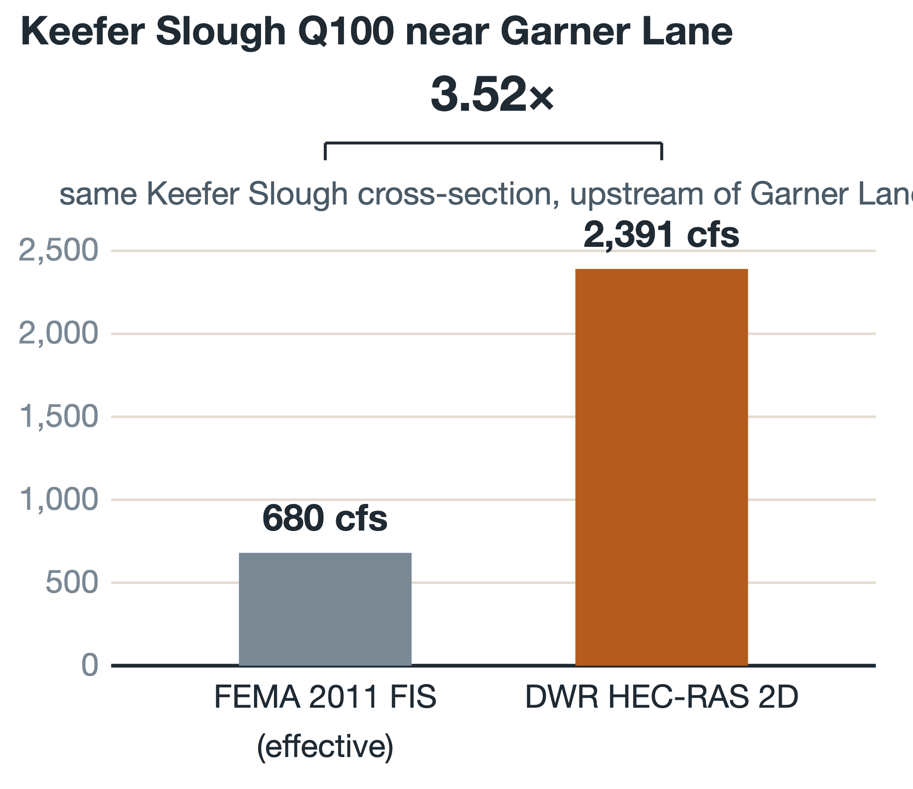

## 3.4 The Bifurcation Has Shifted

The 2011 FIS rated the bifurcation as sending approximately 44 percent of Rock Creek's 100-year discharge into Keefer Slough. The DWR 2D model, reflecting current sediment and vegetation conditions, puts the combined 100-year discharge arriving at the bifurcation at 6,413 cfs, splitting **2,483 cfs (39 percent) to Rock Creek and 3,867 cfs (61 percent) to Keefer Slough** (Lee, 2025, Sec. 1). The channel that was designed by nature to carry most of the water now carries the minority of it. Sediment deposition and vegetation growth at the bifurcation drove the shift; a cleanup occurred in February 2025, and the Caltrans memorandum recommends a standing multi-party maintenance agreement.

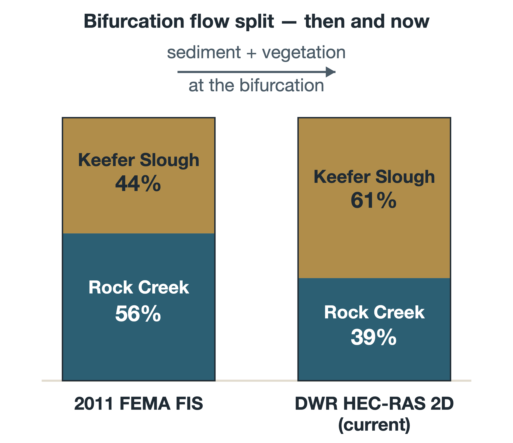

## 3.5 Which Numbers Govern

This report adopts the two-track convention established in the underlying technical analysis:

- **Track A — Nord HEC-HMS "Current Study"** governs **upstream hydrology** (intake sizing, corridor routing). It is the most recent rainfall-runoff analysis built for Rock Creek itself, is internally consistent with the regional 2D model, and was also the hydrologic basis of the Sand Creek Infiltration Study.
- **Track B — DWR HEC-RAS 2D** governs **downstream impact** (Keefer Slough benefit claims, FEMA no-rise demonstration). It reflects the current bifurcation condition and is the model any CLOMR/LOMR submittal will be judged against.

The 2011 FIS values remain the effective regulatory numbers until the FIRM update and are carried for regulatory-context reference only; StreamStats serves as a cross-check.

## 3.6 Why This Matters for the Concept

Two implications frame everything that follows. First, **the concept's benefit story must be told against Track B**: against the DWR 2D baseline, reducing the flow that reaches Keefer Slough is a high-leverage intervention at precisely the location — upstream of the bifurcation — where a diversion physically can act on it. Second, **diversion sizing must be done against Track A**, the upstream-of-bifurcation hydrology, since the DWR 2D post-split values describe what remains after the damage is distributed.

# 4. The Concept

## 4.1 Overview

The concept diverts a portion of Rock Creek's flood flow — only during high-flow conditions — at a controlled intake approximately 1.1 miles upstream of the Rock Creek / Keefer Slough bifurcation. Diverted water is conveyed a short distance to the heads of two overland corridors: a **north route of approximately 6 miles** that follows the Sand Creek system and rejoins Rock Creek near SR 99, and a **south route of approximately 4.4 miles** returning to Rock Creek — approximately **10.4 miles** of treated corridor in total. Along both corridors, **hundreds of low rock weirs**, roughly 2–3 feet tall, slow the flow, spread it laterally, pond it behind each structure, and hold it in contact with the ground long enough to infiltrate. What does not infiltrate or evaporate returns to Rock Creek as a longer, lower, later flood wave.

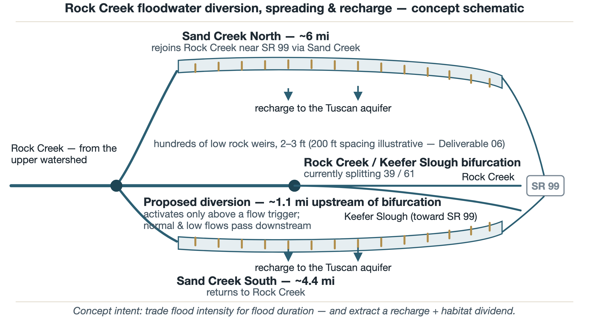

## 4.2 Diversion

The intake would pass all normal and low flows downstream undisturbed and activate only above a trigger threshold. Its location is bracketed by the two Nord precedents (intakes at ~1.4 and ~0.6 miles upstream of the bifurcation). Design capacity, trigger threshold, and structure type are **[VERIFY]** items assigned to the screening analysis; for size context only, Nord's dam-based alternatives designed peak diversions of 3,725–4,955 cfs at Q100 through structures of 300–307 feet in length (Wood Rodgers, 2023, Tables 6–7). The screening analysis in Section 7 indicates that capacity above roughly 3,000 cfs adds little annual yield, because supply — not intake size — becomes the binding constraint.

## 4.3 Conveyance

Diverted water travels in a channelized reach to each corridor head, then is released to spread and meander per existing topography with limited supplemental grading. Nord's diversion-channel precedents ran 3,620–7,440 feet with excavation of roughly 189,000–814,000 cubic yards; shallow bedrock was a significant cost driver in both Nord alignments and must be assumed a risk here as well (Wood Rodgers, 2023, Secs. 9.2.1–9.2.2). Conveyance length for this concept's corridor heads is **[VERIFY]**, dependent on final intake siting.

## 4.4 Two Corridors

The corridors are the project. Rather than impounding water behind one structure, the concept distributes small increments of ponding and roughness across ~10.4 miles. Corridor widths and total reactivated acreage are **[VERIFY]** items pending topographic work and landowner discussions; the OOM analysis carries an assumed active width of ~240 feet, yielding roughly 300 acres of reactivated corridor (bracketed 200–400 acres).

## 4.5 Distributed Low Rock Weirs

Each weir is a rock grade-control structure roughly 2–3 feet tall — trapezoidal, keyed into the banks, with a flat downstream apron. At an illustrative 200-foot spacing, the ~10.4-mile corridor would carry approximately 275 structures. Each individual weir sits far below the 6-foot Division of Safety of Dams jurisdictional height threshold, so no structure is a jurisdictional dam ("These thresholds allow unlimited volumes of storage if the dam height is below six feet" — Wood Rodgers / GeoSystems Analysis, 2023, Sec. 8.0). Cumulative-impact review and CDFW Section 1602 streambed alteration agreements remain fully applicable.

The failure mode is the structural argument for distribution: a dam concentrates risk at one point; a weir field distributes it. A displaced weir affects its own reach, is visible on inspection, and is repaired with rock.

## 4.6 Return to Rock Creek

The north corridor returns via the Sand Creek confluence near SR 99; the south corridor returns to the Rock Creek main channel. The concept's flood-safety mechanism is completed here: the corridor delays and flattens the diverted volume, so that the return peak arrives after the main-channel peak has passed. The screening framework carries both an in-phase (conservative) and fully-lagged (optimistic) bound on this superposition until routing is modeled.

## 4.7 What a Treated Reach Looks Like

The three figures below illustrate one internally consistent set of concept-stage assumptions — 200-foot weir spacing, 2.5-foot weirs, a ~30-foot low-flow channel inside a ~240-foot active corridor, on a ~0.5 percent slope. At these dimensions the backwater from each weir extends roughly 250 feet at design flow, so **the pools overlap into a near-continuous slack-water surface during the design event.** Every dimension is a placeholder for engineered design **[VERIFY]**.

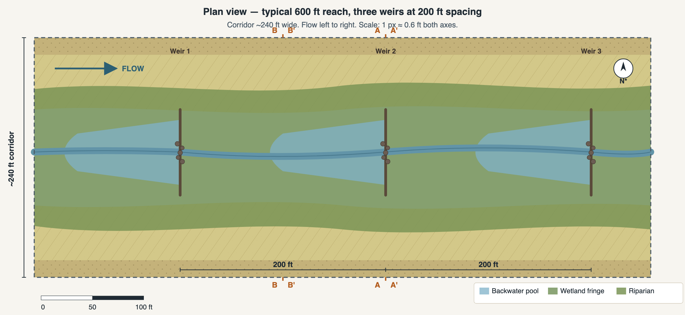


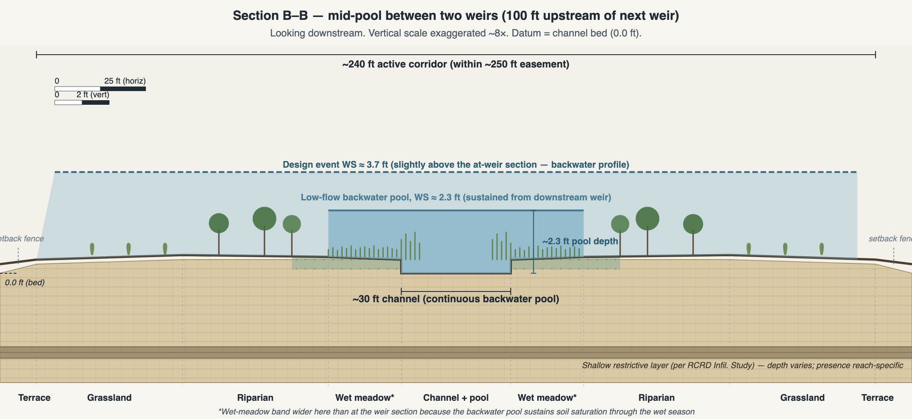

At low and normal flow, each weir holds a small pool at crest level. At a frequent flood (Q2–Q10), flow rises above the crests, spreads onto the benches, and moves overland at greatly reduced velocity — the intensity-for-duration trade. At a 100-year event, the weirs are drowned out and their incremental effect diminishes — the honest limitation discussed in Section 5.5.

Habitat design follows the Singer Creek precedent and the sensitive-species inventory from the Nord environmental-constraints assessment: native planting palettes zoned by inundation frequency (emergent, wet meadow, riparian woody, native grassland, oak terrace); seasonal drawdown designed to favor native amphibians over bullfrogs; open grassland mosaic maintained for Swainson's hawk foraging; elderberry (valley elderberry longhorn beetle host) planted with buffers; all construction outside or surveyed within the February 1 – August 31 nesting window.

# 5. Comparable Projects and Scale Context

## 5.1 Four Tiers of Precedent

The concept is benchmarked at four tiers, in declining geographic relevance: **Tier A**, the local source projects (Nord, Sand Creek Infiltration, Singer Creek); **Tier B**, California Flood-MAR floodplain-reactivation projects; **Tier C**, the USGS rock detention structure pilots of the arid Southwest (the longest peer-reviewed record for distributed low rock structures); and **Tier D**, beaver dam analog / low-tech process-based restoration literature (the closest mechanistic analog for distributed-structure attenuation).

## 5.2 What Each Local Project Contributes

| | Nord Feasibility Study | Sand Creek Infiltration Study | Singer Creek HDP |
|---|---|---|---|
| Mechanism | Diversion + large dams | In-channel dams at 5 basins | Habitat restoration; some check dams |
| Primary goal | Flood risk (Town of Nord) | Groundwater recharge | Species mitigation |
| What transfers | Hydrology, watershed data, unit costs, intake geometry | Infiltration rates, subsurface data, permitting findings | Land control, stewardship, NWP 27 pathway, Tuscan-soils design |
| What does not | Dam attenuation results, $164M mitigation, dam costs | Per-basin recharge volumes (dam-pond specific) | Any flood claims (none analyzed); Caltrans mitigation funding model |

The deepest contrast is structural. Dam-based designs concentrate storage, sediment capture, failure risk, DSOD jurisdiction, and habitat impact at single points — which is why Nord's alternatives cost $222–371 million and carry mitigation obligations rivaling their construction costs. A distributed weir field has no reservoir, no jurisdictional structure, distributed sediment behavior, and a habitat **benefit** rather than a mitigation liability. The cost consequences appear in Section 8.

## 5.3 The Broader Program Context

The concept fits squarely inside California's Flood-MAR framework — the state's endorsed approach for diverting high flows onto floodplains and working lands for recharge, flood-risk reduction, and habitat, explicitly tied to SGMA. Within Butte County, it now also sits alongside the Component 5 preliminary designs for basin-type FloodMAR projects on the same corridor (Section 2.5): the basins concentrate recharge at tested high-capacity sites; the weir corridor distributes it along ~10 miles of channel and floodplain. The most accurate single description of this concept is **a Flood-MAR floodplain-reactivation project on the local Nord / Sand Creek geometry, executed with the rock-detention toolkit of the USGS pilots, with Singer Creek as the land-control and stewardship model.**

## 5.4 Scale Positioning

At ~10.4 miles of treated corridor, the concept is roughly an order of magnitude longer than the documented Southwest RDS pilots (typically reach-scale, on the order of 1 kilometer), several times the Sand Creek study's ~0.6-mile candidate-basin footprint **[VERIFY: RDS pilot extents pending external sources]**, and multiples of Singer Creek's ~2 treated miles. The mechanism is well documented at reach scale; the corridor-scale application is the concept's genuinely novel element, and the screening-then-model roadmap in Section 9 is designed accordingly.

![Figure 9. Linear extent of treated reach: documented RDS pilots (~0.6 mi, [VERIFY]), Nord's diversion channels (~0.7–1.4 mi), Singer Creek (~2 mi), and this concept (~10.4 mi).](figures/fig09-linear-scale.png)

## 5.5 The Honest Caveat: Attenuation Diminishes at Extreme Events

The single most important finding carried from the literature is that distributed-structure attenuation is strongest at frequent-to-moderate floods and **diminishes at the rarest, largest events**. The Sand Creek study reached the same conclusion for its dams: "very large flood events will quickly fill the basin early in the storm... and will pass the peak of such a flood event downstream relatively unattenuated" (Wood Rodgers / GeoSystems Analysis, 2023, Sec. 6.3). For weirs the mechanism is drowning rather than storage exhaustion, but the direction is the same.

Three consequences follow. First, the concept's headline flood-safety value lies at Q10–Q50 — which is also where the four datasets disagree most, and where most cumulative flood damage occurs. Second, the concept's Q100/Q500 performance must be **modeled, never assumed**, and the FEMA no-rise demonstration is a binding constraint on the design. Third, the recharge and habitat benefits do not share this limitation — they accrue every wet season regardless of whether a rare event occurs, which is why the concept is framed as multi-benefit rather than as a flood project alone.

# 6. Feasibility Assessment

Each of the six domains below states what would have to be true, what the sources already establish, and what remains open. Nothing here is a conclusion that the concept is feasible; it is an accounting of which questions remain and how expensive they are to answer.

## 6.1 Hydraulics and Flood Routing

**Would have to be true:** a defined diversion, routed through ~10.4 miles of weir-treated corridor, measurably reduces Rock Creek and Keefer Slough peaks at frequent-to-moderate events, with an honestly characterized result at Q100/Q500 — and **no rise** in 100-year flood elevations anywhere in the regulated floodplain.

**Already established:** the four-dataset hydrology and the two-track governing convention (Section 3); the existence of the DWR / Wood Rodgers 2D model platform, which any CLOMR/LOMR will be judged against; the bifurcation's documented 39/61 condition; Keefer Slough's 525 cfs capacity at SR 99; and a Nord-identified 2,277-foot constriction on Rock Creek downstream of the bifurcation.

**Open:** diversion capacity, trigger, and structure type; per-weir hydraulic-loss characterization and spacing; quantified attenuation at each event from Q10 through Q500; the no-rise demonstration. The screening spreadsheet (technical annex, Deliverable 05) is built; the 2D routing (in the DWR model) is the decisive analysis.

**The bifurcation is a parallel project, not a substitute.** Maintenance at the bifurcation — the Caltrans memorandum's recommendation — would shift the split back toward its historical 56/44 and reduce Keefer flooding on its own. It also changes this concept's design hydrology. The two efforts reinforce each other and should advance together under coordinated analysis; neither replaces the other.

## 6.2 Recharge Feasibility

**Would have to be true:** enough of the ~10.4-mile corridor overlies favorable subsurface — adequate infiltration rate, no laterally continuous shallow restrictive layer, adequate vadose storage — that the corridor produces meaningful net recharge.

**Already established:** the Sand Creek Infiltration Study's 0.7 ft/day long-term rate at favorable sites, the ~50 percent channel-infiltration bonus, and — critically — the **spatial variability finding**: favorable zones follow the lower Sand Creek alluvial channel system (SAGBI-rated good; no restrictive layer in the top 80 inches), while much of the surrounding area rates poor. The concept's north corridor is deliberately routed through that favorable channel system. Component 5 adds independent recent confirmation: field-tested infiltration near the Keefer Slough / Rock Creek confluence was among the most favorable in the subbasin (Geosyntec, 2026, Preface). Vadose-zone storage and aquifer transmissivity are established as sufficient once water passes the surface layer; the constraint is at the surface, not at depth.

**Open:** the **favorable-subsurface fraction along the specific corridors** — the single largest lever in the yield estimate (Section 7). The Sand Creek study's screening sequence (SAGBI/NRCS mapping, then a corridor FDEM geophysical survey, then targeted test pits) transfers directly and is Phase 1 work, estimated in the tens of thousands of dollars, not millions.

## 6.3 Land and Site Control

**Would have to be true:** the corridors are under landowner agreements sufficient for construction, seasonal inundation, and perpetual maintenance access.

**Current picture [VERIFY — the project's first verification item]:** the corridor is understood to involve only **four landowners**. The major landowner holds approximately 9 of the ~10.4 miles — about **87 percent of the corridor** — under an existing **NRCS conservation easement**. One to two smaller ownerships sit at the diversion intake, one on the south route, one on the north route. If confirmed, this is a dramatic simplification relative to the many-family-trust pattern the Nord study documented at watershed scale — and it concentrates the project's fate in a single conversation.

**Consequences:** the major landowner is the **go/no-go partner** — a yes opens ~87 percent of the corridor under an easement framework already oriented to conservation; a no reduces the concept to ~1.4 miles, likely below viable scale. The three smaller owners are individually segment-blockers only. NRCS becomes the load-bearing land-side partner: the existing easement's purposes must be confirmed compatible with seasonal flooding for habitat enhancement (typically addressable by amendment or supplemental management agreement, per the coordination requirement the Sand Creek study documented). The Singer Creek stewardship structure — easement, accredited land trust, endowment — is the model for whatever portions need new instruments.

**Open:** assessor and NRCS records verification (days of work); the four landowner conversations; easement-compatibility determination. These are Phase 1–2 items and among the cheapest high-consequence work in the roadmap.

## 6.4 Water Rights, CEQA, and Permitting

**Would have to be true:** a lawful diversion pathway exists at the volumes the concept needs; CEQA and the federal/state permit suite are achievable on a restoration footing.

**The pathway ladder is now well mapped — largely by Component 5.** The following summarizes Geosyntec (2026), Sections 7.1–7.1.2 and Table 18, which this report adopts as the framework for counsel to test:

| Pathway | Diversion opportunity | Time to obtain | Typical cost |
|---|---|---|---|
| Water Code §1242.1 (flood-only; SB 122, 2023) | ~3 days/yr average (4–6 in wet years) | Immediate to weeks (notice-based) | Low (staff time, reporting) |
| Proposed AB 2026 expansion (pending) | ~4–6 days/yr average (6–10 wet) | n/a — legislative | n/a |
| Temporary Urgency Change Petition | +5–15 days (wet years) | ~1–6 months | ~$10,000–100,000 |
| Appropriative water right permit | +10–30+ days/yr | ~2–5+ years | ~$100,000 to >$1M |

Section 1242.1 permits diversion of flood flows for recharge **without an appropriative right** when a local or regional agency has publicly noticed imminent flood risk — and its use has already been **demonstrated locally** by the Component 5 pilots. Two constraints matter: the authority currently applies only to diversions initiated through **January 1, 2029**, and the flood-notice trigger limits operation to roughly 3 days per year on average in this system (Geosyntec, 2026, Sec. 7.1). Section 7.4 of this report examines what those 3 days mean for yield. The practical strategy that follows: use §1242.1 for early pilot operation while it remains available, and begin the appropriative-right (or TUCP) process in the roadmap's Phase 3 so the long-term pathway matures as the project does. **This framing identifies the candidate pathways; it is not a legal conclusion, and water-rights counsel is a named early work item.**

**Also established:** the SWRCB will require a recharge permit for diverting surface water to groundwater (Wood Rodgers / GeoSystems Analysis, 2023, Sec. 8.0); the Sand Creek system is outside CVFPB jurisdiction (confirm corridor-specific); CDFW Section 1602 applies to all in-channel work; NWP 27 is the demonstrated 404 pathway for restoration intent (Singer Creek precedent); the corridor's sensitive-species exposure is inventoried (Butte County meadowfoam, vernal pool crustaceans, spring-run Chinook and steelhead in Rock Creek proper, valley elderberry longhorn beetle, Swainson's hawk, tricolored blackbird, among others — Wood Rodgers, 2023, Part B environmental constraints); FEMA CLOMR-before / LOMR-after sequencing applies, against the post-2027 regulatory baseline.

**Open:** the water-rights theory of the case (counsel); CEQA lead agency (AGUBC, Vina GSA, or the County, depending on sponsorship structure); ESA Section 7 versus Section 10 posture (a federal nexus — NRCS easement action, 404 permit, or federal funds — triggers Section 7); CLOMR timing relative to the FIRM update.

## 6.5 Sediment and Maintenance

**Would have to be true:** the corridor accepts the diverted sediment load without progressive aggradation that defeats weir function, under a funded perpetual maintenance program.

**Already established:** Rock Creek's sediment supply is characterized (D50 of 13–118 mm across 15 field sites; the bifurcation reach carries the study's highest sediment-supply index — the same process now redirecting flood flow into Keefer Slough). Dam-based designs concentrate sediment capture and starve downstream reaches, requiring routine removal (Wood Rodgers / GeoSystems Analysis, 2023, Sec. 4.0); a distributed weir field accumulates sediment in small per-structure increments and passes pulses at high flow. Singer Creek's grazing-and-monitoring stewardship model is the working maintenance template.

**Open:** sediment yield of the diverted hydrograph; per-weir accumulation rates; the maintenance cycle; downstream sediment-deficit risk (smaller than a dam's, but not zero). The roadmap answers these through a monitored pilot reach before corridor-wide construction.

## 6.6 Cost and Funding Readiness

**Would have to be true:** the cost envelope matches identifiable funding pathways at a local share the beneficiaries would actually pay.

Sections 8 and 10 present the order-of-magnitude answer: a central-case ~$30 million capital cost, of which roughly 75 percent is plausibly grant-fundable across programs whose stated priorities — multi-benefit recharge, flood risk reduction, habitat, SGMA implementation — read almost as a description of this concept; a beneficiary share on the order of $8 million one-time including a ~$3 million endowment; and **no recurring annual assessment**, because endowment yield is designed to carry the ~$120,000-per-year operating cost.

# 7. Water Balance and Recharge Estimate

All values in this section are order-of-magnitude screening estimates presented as low / central / high scenarios, with every input either source-cited or flagged. The arithmetic is reproducible in the screening framework (technical annex, Deliverable 05).

## 7.1 Water Available at the Intake

Two independent approaches converge. A watershed water budget — 25 square miles at the intake, 38 inches mean annual precipitation (~50,700 acre-feet of gross precipitation), a 0.20–0.30 foothill runoff coefficient, and a 30–50 percent high-flow fraction above any plausible trigger — yields roughly **3,000–7,500 AF/yr of divertible water in an average year**. An event-based check (a single Q10 event carries on the order of 5,000 acre-feet; Q5–Q10-class events average about one per year, plus smaller frequent events) lands in the same range. The 24-year CRG precipitation record (19.33 inches average, ranging 5.13–32.22 inches) implies roughly a six-fold swing between wet and dry years: wet-year supply reaches 10,000–15,000 AF; dry years drop below 1,500 AF.

## 7.2 Corridor Acceptance

The corridor's capacity to absorb water is the product of a chain of factors, each bracketed from the sources:

| Factor | Low | **Central** | High | Basis |
|---|---|---|---|---|
| Corridor area (10.4 mi × assumed width) | 200 ac | **300 ac** | 400 ac | Concept; width [VERIFY] |
| Wetted fraction at design event | 60% | **85%** | 95% | Concept-stage assumption |
| Favorable-subsurface fraction | 25% | **50%** | 60% | Sand Creek study screening, corridor-routed (see note) |
| Infiltration rate (ft/day) | 0.2 | **0.6** | 0.7 | Sand Creek study range |
| Days per year of corridor inundation | 15 | **40** | 60 | CRG record; see Sec. 7.4 |
| Channel-infiltration bonus | 1.2× | **1.5×** | 1.5× | GSA finding, "up to 50%" |
| Evapotranspiration addition | +20% | **+25%** | +30% | Standard valley vegetation |
| **Annual diverted volume (recharge + ET)** | **~130 AF/yr** | **~5,800 AF/yr** | **~18,700 AF/yr** | product |

The central-case favorable fraction (50 percent) is higher than the Sand Creek study's watershed-wide hit rate (5 favorable sites of 20 candidates) for a stated reason: the corridors are **deliberately routed through the lower Sand Creek alluvial system** that the SAGBI mapping rates good, rather than sampled randomly across the watershed. The central infiltration rate (0.6 ft/day) sits below the 0.7 ft/day the study assigns to FDEM-screened favorable sites. The full recentering logic is documented in the technical annex (Deliverable 07, Section 2.3a).

## 7.3 The Binding Constraint and the Realized Yield

Central-case corridor capacity (~5,800 AF/yr) and central-case supply (~5,000–6,000 AF/yr divertible) are roughly balanced — the concept is neither badly over- nor under-built at these assumptions. The realized long-term average is estimated at **~5,000–7,000 AF/yr, with ~6,000 AF/yr used as the central planning value**: supply-limited in most years, capacity-limited (with excess passing downstream by design) in wet years. A diversion capacity of roughly 3,000 cfs is adequate; larger intakes add cost without adding water.

## 7.4 Diversion Days versus Inundation Days — the §1242.1 Reconciliation

The Component 5 analysis found that flood-only diversion under Water Code §1242.1 offers approximately **3 days per year** of qualifying diversion opportunity in this system (Geosyntec, 2026, Sec. 7.1). The corridor model above assumes **15–60 days per year of inundation**. These two numbers describe different things, and the distinction matters:

- **Diversion days** are when the intake is legally and hydrologically taking water. Flood pulses are volumetrically large: one cfs flowing for one day is ~1.98 acre-feet, so a 2,000–3,000 cfs diversion operating for ~3 days delivers on the order of **12,000–18,000 acre-feet** into the corridors — more than the central-case annual volume — even under the narrowest current authority. **[VERIFY: event-coincidence and intake-rating analysis in the Phase 2 screening]**
- **Inundation days** are how long diverted water then sits on and behind the weirs, infiltrating at 0.2–0.7 feet per day as the pools draw down over the following weeks. The 40-day central assumption describes that drawdown residence, not the diversion window.

The reconciliation is therefore **plausible but unverified**: short legal diversion windows can source long infiltration residence. What the §1242.1 pathway does constrain is operational flexibility and durability — the authority currently sunsets for diversions initiated after January 1, 2029, and its flood-notice trigger cannot capture below-flood-stage high flows. That is why Section 6.4 pairs near-term §1242.1 pilot operation with a Phase 3 start on the appropriative-right process, which would add 10–30+ operable days per year and remove the sunset risk (Geosyntec, 2026, Table 18).

## 7.5 The Recharge in Subbasin Context

A central-case ~6,000 AF/yr sits: at roughly **60–90 percent of the subbasin's current annual storage growth** (~8,000 AF/yr, WY 2025 Vina GSA Annual Report); at roughly **a quarter to a third of the Recharge Action Plan's ~20,000 AFY countywide expansion goal**, from a single project in the Plan's priority subbasin, implementing the Plan's first-listed category of action; and alongside — not instead of — the Component 5 basin projects advancing on the same corridor.

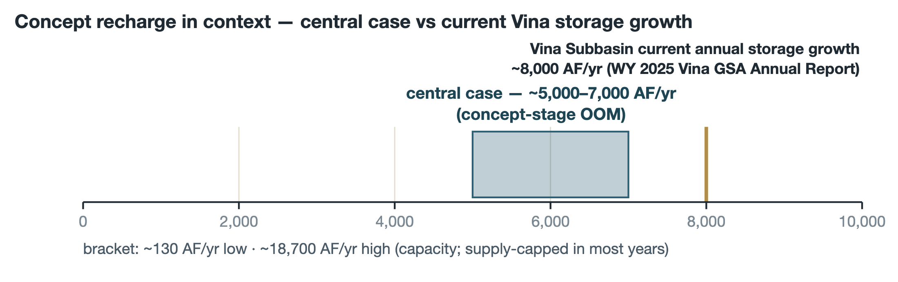

## 7.6 The Flood-Attenuation Benefit

Separately from recharge, the corridor delays and flattens the diverted share of each flood. Literature-derived expectations for a corridor of this scale put frequent-event (Q5–Q10) peak reduction at **25–40 percent [VERIFY: literature-derived, not site-modeled]**, with materially smaller effect at Q100/Q500 per the diminishing-attenuation finding. The screening targets in Section 9 treat a 10 percent Q10 reduction at SR 99 as the minimum worth pursuing and 25 percent as acceptable; the 2D routing decides.

# 8. Order-of-Magnitude Cost and Benefit

## 8.1 Capital Cost

Costs are built bottom-up: Nord's 2023 unit costs for the items that transfer (channel excavation at $6/cy, in-creek concrete at $40/cy, foundation preparation), per-weir installed costs of ~$10,000–15,000 derived from the reach design **[VERIFY: to be benchmarked against RDS pilot actuals]**, Singer-Creek-style restoration and stewardship costs, and standard concept-stage allowances.

| Category | Central ($M) |
|---|---|
| A. Intake / diversion structure | 4.5 |
| B. Conveyance to corridor heads | 2.5 |
| C. Rock weirs (~275 at 200-ft spacing) | 3.5 |
| D. Plantings + corridor restoration (~300 ac) | 3.5 |
| E. Engineering / design / project management | 1.5 |
| F. Permitting, CEQA, ESA, CDFW, FEMA CLOMR | 2.0 |
| G. Land control (easements) | 2.0 |
| H. Pre-construction + 5-yr establishment monitoring | 0.7 |
| I. Perpetual O&M endowment seed | 3.0 |
| J. Contingency (~25–30%) | 6.5 |
| **Total one-time capital (central)** | **~$30 M** (low ~$17.5M / high ~$50M) |

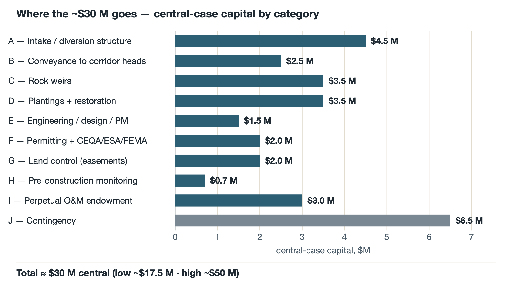

A phased alternative matches the Singer Creek funding model: Phase 1, north corridor plus intake and permitting (~$15–20M, yielding ~1,500–1,800 AF/yr at central assumptions); Phase 2, south corridor (~$10–15M, adding ~1,000–1,200 AF/yr).

## 8.2 Nothing Recurs for the Beneficiaries

Every line above is one-time. Ongoing operations — sediment and vegetation management, biennial structure inspections, monitoring, stewardship-organization fees, insurance, and a major-event repair reserve — total approximately **$120,000 per year** in the central case, and the ~$3 million endowment (category I) is sized to generate that amount at a 4 percent yield. The design intent is explicit: **fund the capital once, and impose no recurring annual assessment** on AGUBC members, Vina GSA payers, or the County. The honest stress tests: endowment underperformance at 2 percent would leave a ~$60K/yr gap; a 100-year-class flood could impose $0.5–2M of repairs, addressed through the reserve, post-event FEMA recovery funding, or a sinking fund; and any landowner preference for annual lease payments over one-time easement compensation would shift cost category G into a recurring item — one of the questions the landowner conversations must answer.

## 8.3 Who Pays: the Funding Stack

Roughly **75 percent of the central-case capital — about $22 million — is plausibly grant-fundable**, blended across the programs surveyed in Section 10 (categories A–D each rate 75–100 percent eligible against current program criteria; the endowment is the hard piece, at 0–30 percent). The remaining **~$8 million beneficiary share** — of which ~$3 million is the endowment — substantially **is** the local match most grant programs require (typically 25–50 percent), rather than a cost on top of it. Cost-allocation across beneficiaries (Vina Subbasin landowners and GSA payers, Butte County, Caltrans, AGUBC members, Tuscan Water District, private philanthropy) is a conversation for a later phase; the technical annex carries a starting-point allocation keyed to benefit received, and mitigation-style revenue (Section 10) could reduce the share by roughly $3 million.

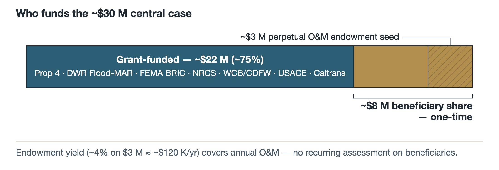

## 8.4 What the Water Costs

Three framings answer three different questions, and the one that matters for the local decision is the first:

| Framing | Capital share | Levelized cost | Answers |
|---|---|---|---|
| **Beneficiary share** | ~$8M (incl. $3M endowment) | **~$77/AF** | What do local beneficiaries pay per acre-foot? |
| Grant-funded share | ~$22M | ~$212/AF | What do state/federal funders pay per acre-foot? |
| Total project | ~$30M | ~$308/AF | How does the whole project benchmark? |

*30-year life, 4 percent discount (capital recovery factor 0.0578), ~6,000 AF/yr central yield, $0 recurring beneficiary O&M (endowment-covered).*

In the framing that governs the local conversation: **AGUBC and partners contribute ~$8M to a $30M project, and in return receive ~6,000 AF/yr of new recharge — a local cost of about $77 per acre-foot, well below the California surface-water market range of $300–2,000/AF.**

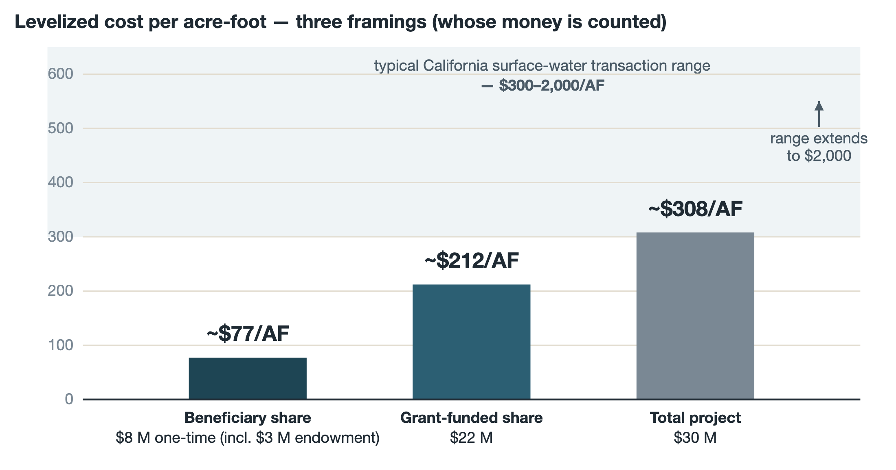

## 8.5 Benchmarks

Even the society-wide framing is competitive: ~$308/AF sits at the low end of California groundwater-banking projects ($100–1,000/AF), below surface-water transaction prices ($300–2,000/AF), and far below new off-stream storage ($1,000–3,000/AF). The most local benchmark is the County's own: Component 5 estimates Site N6 — a basin project on this same Keefer Slough / Rock Creek corridor, with the same flow-redistribution and attenuation co-benefits — at **$100–700 per acre-foot total economic cost, or $30–150 per acre-foot if capital is grant-funded** (Geosyntec, 2026, Sec. 7.5). This concept's ~$308/$77 pairing lands inside both of those ranges.

Unmonetized co-benefits sit outside the $/AF arithmetic: avoided flood damage to homes, infrastructure, and SR 99 (which the Caltrans memorandum implies will be repriced sharply after the FIRM update); ~300 acres of created habitat; SGMA-compliance value to the Vina GSA ahead of the 2027 GSP periodic evaluation; and the regional value of a demonstrated Flood-MAR exemplar.

## 8.6 What Moves the Answer

In order of leverage: (1) **the landowner structure** — confirmation of the four-owner picture collapses both cost and timeline, and the major landowner's answer is the project's gate; (2) **favorable-subsurface fraction** — a ~10× yield spread, resolved by an inexpensive FDEM survey and test pits; (3) **days of inundation**, tied to the water-rights pathway (Section 7.4); (4) **corridor width/area**; (5) **diversion capacity**, with diminishing value above ~2,500–3,000 cfs; (6) contingency; (7) phasing choices.

# 9. Implementation Roadmap

## 9.1 Master Sequence

The roadmap is organized so that the cheapest, highest-consequence uncertainties are resolved first, and no major capital is committed before the go/no-go gate.

| Phase | Months | Focus | Key outputs |
|---|---|---|---|
| 0 — Concept synthesis (complete) | 0–3 | The eight technical deliverables; this report | Concept documents; four-dataset screen |
| 1 — Foundational data and relationships | 3–9 | Corridor DEMs; SAGBI/NRCS + FDEM screen; landowner and NRCS records; OOM cost; bifurcation MOU concept | Verified landowner picture; reach-favorability map |
| 2 — Screening and confirmation | 6–18 | Routing screen; test pits; **the major-landowner conversation — the go/no-go gate (~month 12)**; NRCS compatibility | Gate cleared, or concept re-scoped |
| 3 — Regulatory pathway and design | 12–30 | 2D routing + no-rise; water-rights counsel and pathway filings; CEQA scoping; ESA/CDFW pre-consultation; easement frameworks; funding applications | Permitted, designed Phase-1 package |
| 4 — Phase-1 construction | 30–48 | North-corridor pilot reach first, then buildout; monitoring | Built reach + performance data |
| 5 — Long-term stewardship | 48+ | Endowed O&M on the Singer Creek model; south corridor as Phase 2 | Perpetual program |

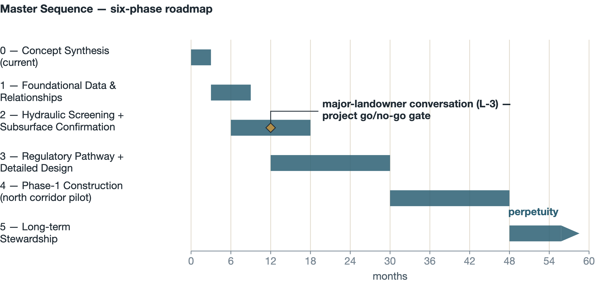

## 9.2 The Gate

Everything before month ~12 is deliberately inexpensive: records work, public-data screening, a geophysical survey, and four conversations. The decision that matters — whether the owner of ~87 percent of the corridor is willing — is made with real information but before major spending. A yes unlocks both corridors under an existing conservation framework. A no ends the concept at scale, at a total sunk cost measured in the low hundreds of thousands of dollars rather than millions.

## 9.3 The Analysis Ladder

Screening exists to decide whether the concept is worth 2D routing; 2D routing decides whether it is worth designing; design decides whether it is worth building. Each rung is materially more expensive than the last, and each can end the project before the next expense.


## 9.4 Near-Term Actions (First 12 Months)

1. Verify the four-landowner picture against Butte County Assessor and NRCS easement records (days of GIS work).
2. Run the SAGBI / NRCS Web Soil Survey screen on both corridors; procure the corridor FDEM survey (the Sand Creek study's Collier Geophysics precedent).
3. Obtain the DWR / Wood Rodgers HEC-RAS 2D model files via the DWR Northern Region Office and/or under the Nord scope.
4. Hold the four landowner conversations, the major landowner first — relationship-led, no instruments.
5. Open the NRCS easement-compatibility discussion in parallel.
6. Retain water-rights counsel to test the §1242.1-now / appropriative-later strategy of Section 6.4.
7. Advance the bifurcation-maintenance MOU concept with the County and Caltrans as a parallel, mutually reinforcing measure.
8. Map the concept against the current Prop 4, Flood-MAR, and NRCS funding calendars (Section 10) so applications are ready when the gate clears.

# 10. Potential Funding

The funding landscape for exactly this project type is strong and recently refreshed. At the state level, **Proposition 4 (2024)** allocates approximately $3.8 billion for water resilience, including groundwater recharge, flood management, and multi-benefit land repurposing, with major solicitations expected over the next several years (Geosyntec, 2026, Sec. 8); DWR's SGM and IRWM programs continue as the recharge workhorses, and **DWR Flood-MAR resilience funding** is the most precisely targeted fit. The **Multi-benefit Land Repurposing Program** (Department of Conservation) funds voluntary repurposing of agricultural land for recharge, floodplain expansion, and habitat — delivered through GSA block grants, which makes Vina GSA coordination essential. SWRCB stormwater grants and CWSRF financing can supplement construction. Federally, **FEMA BRIC/FMA** fund flood-risk reduction (annual/biennial cycles; the project must appear in local hazard mitigation plans), **NRCS** programs (EQIP, RCPP, ACEP easements, and the PL-566 watershed program) align with the corridor's agricultural-easement reality, and **Reclamation WaterSMART** supports design and construction at 50 percent non-federal share. The Wildlife Conservation Board and CDFW restoration programs cover the habitat scope.

Four strategy notes govern the approach. **Layer, don't lump:** a ~$30M project is fundable as 3–5 tranches aligned with phasing, not as one award; this is also Component 5's stated strategy for its sites. **The beneficiary share is the match:** most programs require 25–50 percent local participation, which the ~$8M share satisfies by design — verify each program's match-stacking rules individually. **The endowment is raised, not granted:** plan on AGUBC member capital, GSA reserves, and a private-foundation lead gift for the ~$3M seed. **Public-agency partnership is structural:** most programs require a public co-applicant or fiscal agent; the Vina GSA and Butte County are the natural partners, and AGUBC's role in Component 5 is the working precedent for that structure.

Finally, the habitat itself can contribute revenue. A full mitigation bank is **not recommended** — additionality rules (habitat used as the project's own permit basis cannot be resold as credits) plus a $2–5M establishment cost and thin regional credit demand defeat it. But a **single-buyer mitigation agreement** — most plausibly with Caltrans, whose SR 99 program has both a documented flood nexus and recurring mitigation needs, on the Singer Creek template — plus opportunistic **in-lieu-fee participation** could realistically contribute on the order of **$3 million** over project life, reducing the beneficiary share or fortifying the endowment.

# 11. References

Butte County Department of Water and Resource Conservation, 2024. *Butte County Recharge Action Plan.* February 13, 2024.

Federal Emergency Management Agency (FEMA), 2011. *Flood Insurance Study, Butte County, California.* (Effective discharges as reproduced in Wood Rodgers, 2023, Table 12.)

Geosyntec Consultants, Inc., 2021. *Vina Groundwater Subbasin, Groundwater Sustainability Plan (GSP).* December 2021. (Submitted January 2022; approved by DWR July 2023.)

Geosyntec Consultants, Inc., 2026. *Combined Groundwater Recharge Investigation and Preliminary Design Report / Pilot Project Implementation Report.* Vina Groundwater Sustainability Agency SGM Grant, Component 5: Surface Water Supply and Recharge Feasibility Study. Prepared for the Butte County Department of Water and Resource Conservation. June 2026.

Lee, Sungho, PE, 2025. *Studying the Flooding Issues Along Hwy 99 from Mud Creek to Rock Creek.* California Department of Transportation, District 3 Hydraulic Branch memorandum. November 2025.

Restoration Resources, 2008–2009. *Singer Creek Preserve Habitat Development Plan, Volume 1.* Prepared for the Butte County Association of Governments (BCAG).

Vina Groundwater Sustainability Agency, 2026. *Vina Subbasin Annual Report, Water Year 2025.* March 2026.

Wood Rodgers, Inc., 2023. *Nord Feasibility Study, Part A and Part B Appendices 1–11.* Prepared for Butte County / California Department of Water Resources. August 2023.

Wood Rodgers, Inc., with GeoSystems Analysis, Inc., 2023. *Rock Creek Reclamation District Infiltration Feasibility Study.* October 2023.

# Appendix A — Technical Annex (Incorporated by Reference)

The eight concept-stage technical deliverables underlying this report are maintained, with their full parameter tables, citations, and [VERIFY] inventories, at the project's online technical annex: **https://agubc-vina.github.io/rock-creek-floodplain/technical.html**

| Deliverable | Content |
|---|---|
| 00 | Deliverables index and source-document key |
| 01 | Refined concept and 50-parameter table |
| 02 | Discharge dataset comparison and governing-dataset recommendation |
| 03 | Comparable-project benchmarking matrix (four tiers) |
| 04 | Feasibility and next-steps roadmap (six domains) |
| 05 | Flood-routing and recharge screening framework |
| 06 | Typical reach design at 200-foot spacing |
| 07 | Order-of-magnitude cost-benefit and target framework |

A companion overview dashboard summarizing this report's key messages is maintained at **https://agubc-vina.github.io/rock-creek-floodplain/**.

# Appendix B — Source Documents

Full markdown transcriptions of the Nord Feasibility Study (Part A and the five Part B appendices), the Rock Creek Reclamation District Infiltration Feasibility Study, the Singer Creek HDP Volume 1, and the Caltrans District 3 memorandum are maintained in the project repository and linked from the technical annex, together with original PDFs of the RCRD study and the Caltrans memorandum.

---

*Prepared by the Agricultural Groundwater Users of Butte County (AGUBC), July 2026, for discussion with the Butte County Department of Public Works and the Department of Water and Resource Conservation. Concept-stage synthesis; not engineering, legal, or water-rights advice.*
